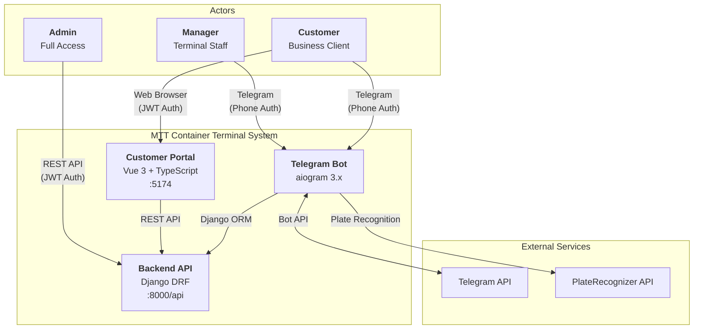
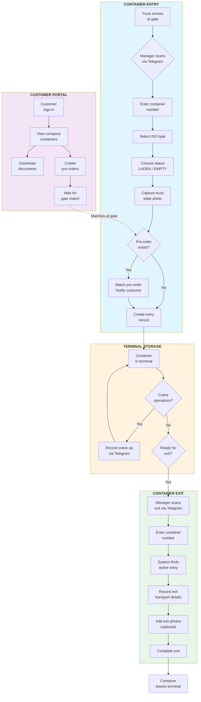
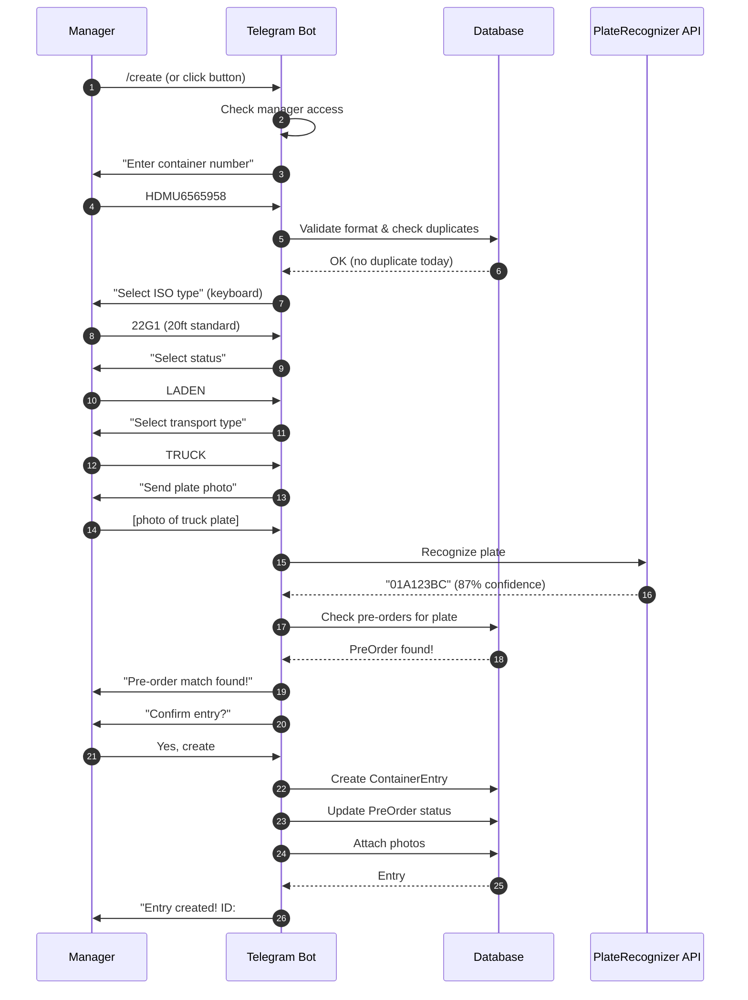
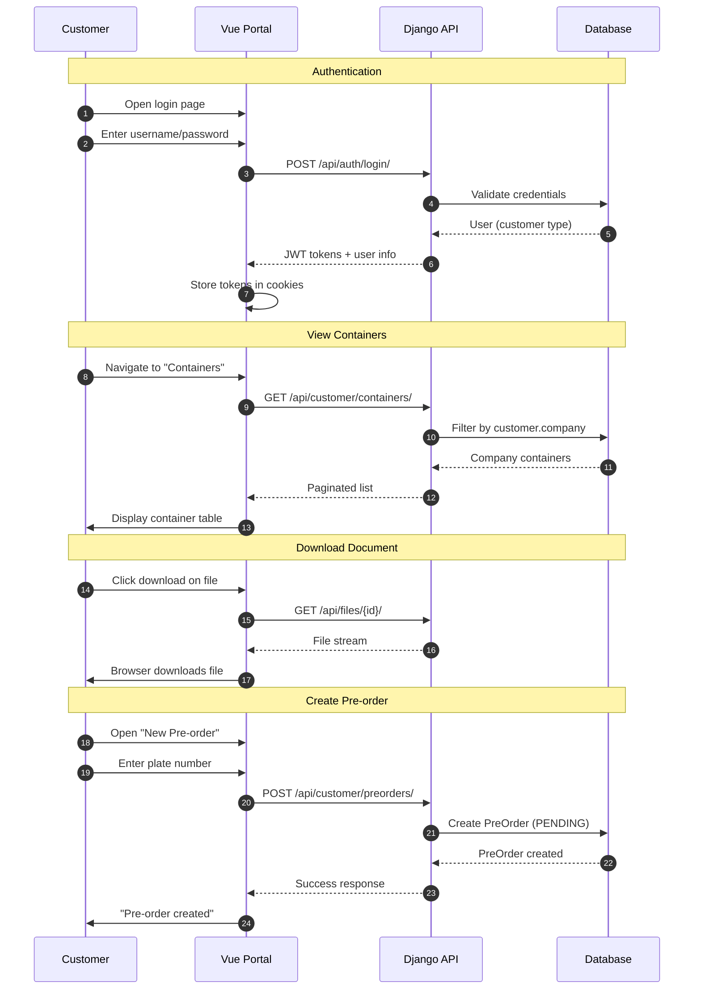
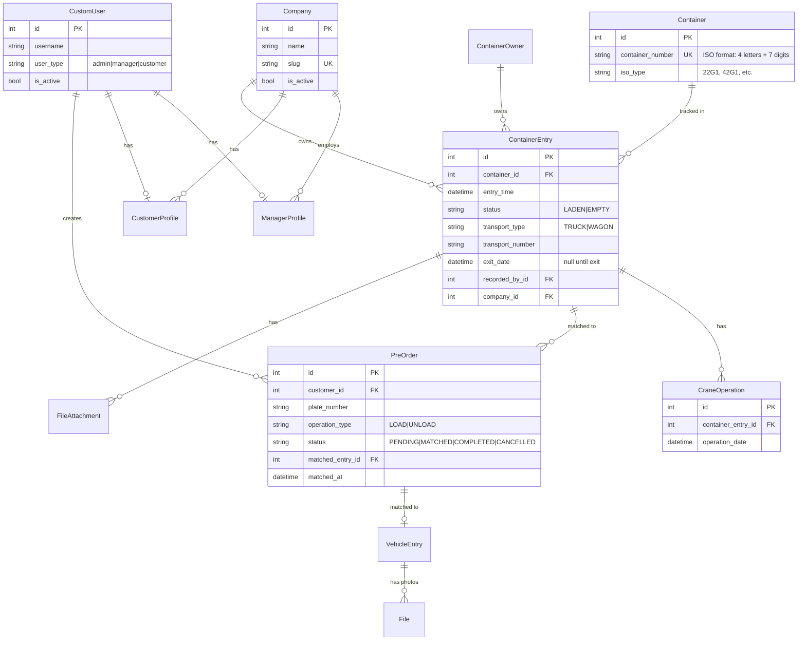
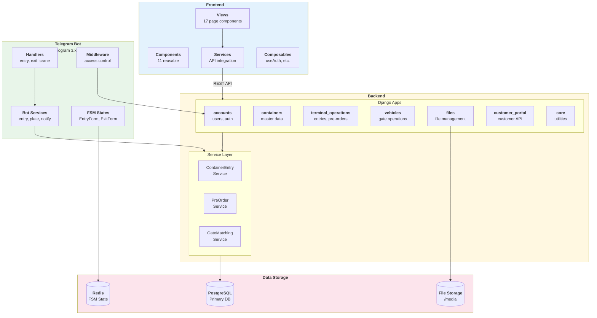

# MTT Container Terminal - Architecture Documentation

> **MTT** (Multi-modal Terminal Tracking) - A full-stack container terminal management system

## Table of Contents

- [System Overview](#system-overview)
- [System Context](#1-system-context-diagram)
- [Business Process Flow](#2-business-process-flow)
- [Container Entry Flow](#3-container-entry-sequence)
- [Customer Portal Flow](#4-customer-portal-sequence)
- [Data Model](#5-data-model-erd)
- [Component Architecture](#6-component-architecture)

---

## System Overview

MTT is a container terminal management system that enables:

| Actor | Access Method | Capabilities |
|-------|--------------|--------------|
| **Admin** | Web API | Full system access, user management |
| **Manager** | Telegram Bot | Container entry/exit, crane operations |
| **Customer** | Web Portal + Telegram | View containers, download documents, create pre-orders |

---

## 1. System Context Diagram

Shows **who** uses the system and **how** they interact with it.



### Access Methods

| Actor | Authentication | Interface |
|-------|---------------|-----------|
| Admin | Username + Password (JWT) | REST API |
| Manager | Phone number (Telegram) | Telegram Bot |
| Customer | Username + Password (JWT) | Vue.js Portal |
| Customer | Phone number (Telegram) | Telegram Bot |

---

## 2. Business Process Flow

The complete **container lifecycle** from gate entry to exit.



### Container States

| State | Description |
|-------|-------------|
| **Entry Created** | Container registered in system with entry details |
| **In Terminal** | Container stored, may have crane operations |
| **Exit Recorded** | Container has left terminal with exit details |

### Pre-order Matching Flow

1. Customer creates pre-order with truck plate number
2. When truck arrives, manager photographs plate
3. System auto-recognizes plate via PlateRecognizer API
4. If match found, pre-order status changes to `MATCHED`
5. Customer receives notification

---

## 3. Container Entry Sequence

Technical flow when a **manager enters a container** via Telegram.



### Entry Data Collected

| Field | Required | Source |
|-------|----------|--------|
| Container Number | Yes | Manual input |
| ISO Type | Yes | Keyboard selection |
| Container Owner | No | Keyboard selection |
| Status (LADEN/EMPTY) | Yes | Keyboard selection |
| Transport Type | Yes | Keyboard selection |
| Transport Number | Yes | Plate recognition or manual |
| Photos | No | Telegram photos |

---

## 4. Customer Portal Sequence

Flow when a **customer uses the web portal**.



### Customer Capabilities

| Feature | Description |
|---------|-------------|
| **View Containers** | See all containers belonging to their company |
| **Container Details** | View entry/exit info, photos, documents |
| **Download Files** | Download attached images, PDFs, documents |
| **Create Pre-orders** | Register expected truck arrivals |
| **Track Pre-orders** | Monitor status (PENDING → MATCHED → COMPLETED) |

---

## 5. Data Model (ERD)

Key entity relationships in the system.



### Key Relationships

| Relationship | Description |
|--------------|-------------|
| **User → Profile** | CustomUser has either ManagerProfile or CustomerProfile |
| **Company → Users** | Company has many managers and customers |
| **Company → Entries** | Company owns container entries |
| **Container → Entries** | One container can have multiple entry/exit cycles |
| **Entry → PreOrder** | Pre-order matched to container entry at gate |
| **Entry → CraneOps** | Multiple crane operations per entry |

---

## 6. Component Architecture

Technical system components and their relationships.



### Technology Stack

| Layer | Technology | Purpose |
|-------|------------|---------|
| **Frontend** | Vue 3, TypeScript, Vite | Customer portal SPA |
| **UI Library** | Ant Design Vue | Component library |
| **Backend** | Django 5.2, DRF | REST API |
| **Telegram Bot** | aiogram 3.x | Manager interface |
| **Database** | PostgreSQL | Primary data store |
| **Cache/FSM** | Redis | Bot state management |
| **File Storage** | Local/S3 | Document storage |

### Service Layer Pattern

All business logic resides in the service layer (`apps/*/services/`):

```
apps/
├── accounts/services/
│   ├── customer_service.py
│   ├── manager_service.py
│   └── company_service.py
├── terminal_operations/services/
│   ├── container_entry_service.py
│   ├── preorder_service.py
│   └── gate_matching_service.py
└── telegram_bot/services/
    ├── entry_service.py
    └── notification_service.py
```

---

## API Endpoints Summary

### Authentication (`/api/auth/`)

| Method | Endpoint | Description |
|--------|----------|-------------|
| POST | `/login/` | Login (username or phone) |
| POST | `/logout/` | Logout & blacklist token |
| POST | `/token/refresh/` | Refresh JWT token |
| GET | `/profile/` | Current user profile |

### Terminal Operations (`/api/terminal/`)

| Method | Endpoint | Description |
|--------|----------|-------------|
| GET | `/entries/` | List containers (60+ filters) |
| POST | `/entries/` | Create container entry |
| PATCH | `/entries/{id}/` | Update entry |
| POST | `/entries/import_excel/` | Bulk import |
| GET | `/entries/export_excel/` | Export filtered |

### Customer Portal (`/api/customer/`)

| Method | Endpoint | Description |
|--------|----------|-------------|
| GET | `/containers/` | Company containers |
| GET | `/preorders/` | Customer pre-orders |
| POST | `/preorders/` | Create pre-order |
| PATCH | `/preorders/{id}/` | Update pre-order |

---

## Quick Reference

### Container Number Format
- **ISO Standard**: 4 letters + 7 digits
- **Example**: `HDMU6565958`
- **Validation**: Auto-uppercase, format check

### Container Status
- `LADEN` - Contains cargo
- `EMPTY` - No cargo

### Transport Types
- `TRUCK` - Road transport
- `WAGON` - Rail transport

### Pre-order Status Flow
```
PENDING → MATCHED → COMPLETED
    ↓
CANCELLED
```

---

*Last updated: January 2026*
